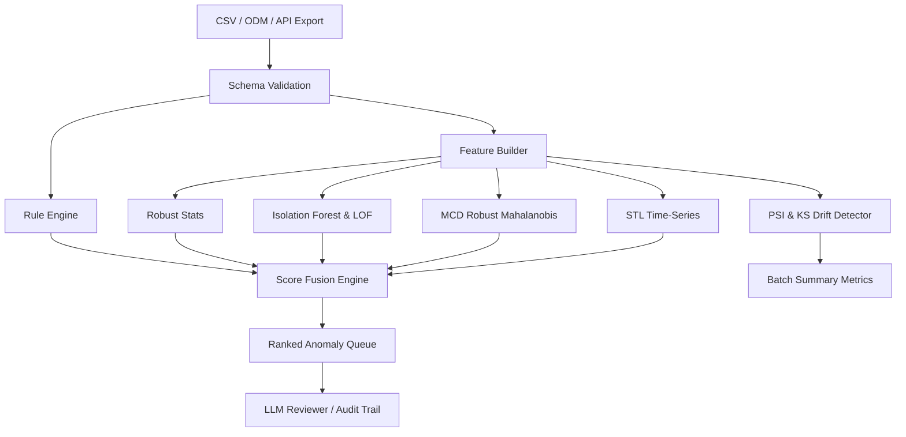

# EDC/RWD Anomaly Detection Skill (v0.2.0)

> 注: ディレクトリ名は `anomaly-detection` です。Python package 名は `anomaly_detection` です。

EDC/eCRF export、RWD/eSource 由来データ、監査証跡、query log、site-level risk indicator を対象に、**ルールベース + robust statistics + Isolation Forest + LOF + MCD (Robust Mahalanobis) + STL (時系列分解) + PSI/KS (分布シフト) + LLM review** を組み合わせて異常・外れ値候補を優先順位付けするAIエージェントSkillです。

## 想定ユースケース

- EDC export CSVの必須欠損、重複、時系列矛盾、範囲外値、施設差、分布ドリフトの検出
- RBQM / Central Monitoring / Data Quality Review のレビューキュー作成
- CDISC ODM / SDTM / ADaM / OMOP / FHIR へのマッピング前後の品質確認
- 監査証跡、変更頻度、query残存、lock/freeze状態を含む provenance anomaly の検出

## システム構成



## セットアップ (`uv` 対応)

```bash
cd .agent/skills/anomaly-detection

# ワンコマンド環境構築
python3 scripts/setup_env.py

# ヘルスチェック & L2自動診断修復
uv run python scripts/check_health.py

# テスト実行
uv run pytest tests/
```

## 最小実行例

```bash
make synth
make infer
```
※ `make infer` による出力成果物は `skill_out/anomaly_detection/run_<id>/anomaly_results.jsonl` に保存され、実行ごとに独立して隔離・保護されます。

## 主要ファイル

```text
.agent/skills/anomaly-detection/
├── .github/workflows/ci.yml
├── configs/
├── docs/schemas/output.schema.json   # v0.2.0 スキーマ
├── scripts/
│   ├── setup_env.py                 # ワンコマンドuv構築
│   ├── check_health.py              # L1/L2自動診断修復
│   ├── infer.py
│   └── generate_synth.py
├── src/anomaly_detection/
│   ├── detectors/                   # IForest, LOF, MCD, STL, PSI
│   ├── fusion.py                    # Score Fusion モジュール
│   └── pipeline.py
├── tests/
├── pyproject.toml
├── uv.lock                           # 決定論的環境ロックファイル
├── README.md
├── SKILL.md
└── Makefile
```

## 設計原則

1. **異常確定ではなくレビュー優先順位付け**を行う。
2. ルール違反、モデルスコア、説明、監査証跡を分離して保存する。
3. reviewer feedback は pseudo-label として保管し、後段の教師ありモデルに接続する。
4. PHI/PII をログに出さない。record_id は原則 surrogate key とする。
5. モデル version、config hash、schema version (`v0.2.0`)、実行時刻を audit trail として残す。
