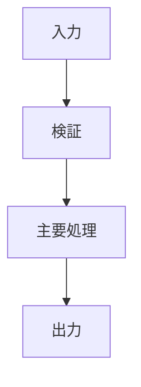

# コード理解レポート

> 複雑度が `simple` の場合は、Mermaidの代わりに文章または箇条書きの処理フローを記載する。`complex` の場合はMermaidを使用する。

> 保存先: `skill_out/code_understanding/<target>/run_<id>/report.md`

## 結論

コードの目的と主要な注意点を1〜3文で示す。

## 対象と前提

- 対象:
- 実行環境:
- 入力:
- 出力:
- 不明点:

## 全体像

### まず押さえる3点

1.
2.
3.

### 主要要素

| 名前 | 種類 | 役割 |
|---|---|---|
|  |  |  |

## 処理フロー

## 詳細

### 入力例で追跡

| ステップ | 値・状態 | 説明 |
|---:|---|---|
| 1 |  |  |

### 副作用

| 副作用 | 場所 | 影響 |
|---|---|---|
|  |  |  |

## 初学者向け用語解説

| 用語 | このコードでの意味 | 一般的な意味 |
|---|---|---|
|  |  |  |

## 注意点・リスク

- 事実:
- 推論:
- 未確認:
- 必要なテスト:

## 根拠ファイル・行番号

- `path/to/file.py:1`
