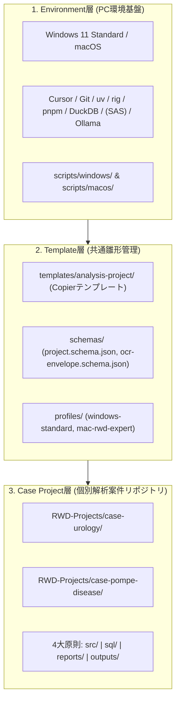

# 阪大・統計専門家向け RWD 解析・AI Agent 開発環境基盤

[](openspec/)
[](https://www.python.org/)
[](https://www.r-project.org/)
[-green.svg)](https://www.sas.com/)
[](LICENSE)

既存のSAS資産（CP932）やOffice報告業務を維持しつつ、Python、R、Git、AI Agent（Cursor / ローカルLLM）を活用したモダンで再現性の高いReal World Data（RWD）解析基盤です。

> 💡 **SASをお持ちでない方へ**: 本基盤は **SASが未導入のPCでも、Python 3.12 / R 4.4 / DuckDB / Quarto による最新の解析環境を100%利用可能** です。

> 🧭 **GitHubアカウントをお持ちでない方へ**: 初期セットアップとローカルのCase Project作成には、GitHubアカウントは必要ありません。まずは配布されたZIPを展開し、PC内で解析を始められます。GitHubは、共同作業やバックアップが必要になった段階で追加すれば十分です。

---

## 🏛️ 3層アーキテクチャ



---

## 🧭 利用フェーズ別ナビゲーション

### ① 【初めて使う方】Windows 11 初期環境セットアップ
クリーンな Windows 11 PC に解析ツール群（Git, uv, Python 3.12, R 4.4, Quarto, DuckDB, Node.js, Cursor設定）を一括自動導入します：

- **ワンクリック実行（推奨）**: 本リポジトリを展開し、ルートの **`Setup-Windows.bat`** を右クリック → **「管理者として実行」**
- **PowerShell から実行**:
  ```powershell
  Set-ExecutionPolicy -Scope Process -ExecutionPolicy Bypass
  .\scripts\windows\Setup-WindowsEnvironment.ps1
  ```
- 📖 詳細は [クリーン Windows 11 初期セットアップ手順書](docs/windows-bootstrap-guide.md) をご覧ください。

---

### ② 【導入済みの方】新規解析テーマ（Case Project）の生成
解析テーマ（例: 泌尿器科、ポンペ病等）ごとに、独立したGitリポジトリを1コマンドで生成します：

```powershell
# 【パターン A】 Python 主解析（SAS不要・推奨）
.\scripts\project\New-AnalysisProject.ps1 -Name "case-urology" -PrimaryLanguage "python"

# 【パターン B】 R 主解析（SAS不要・推奨）
.\scripts\project\New-AnalysisProject.ps1 -Name "case-urology" -PrimaryLanguage "r"

# 【パターン C】 既存SAS併用（SAS保有時のみ）
.\scripts\project\New-AnalysisProject.ps1 -Name "case-urology" -PrimaryLanguage "sas" -SasEncoding "cp932"
```

```bash
# macOS の場合
./scripts/project/new-analysis-project.sh case-pompe-disease mac-rwd-expert sensitive python
```

---

### ③ 【日常の解析を行う方】解析実行・報告書作成・運用
- 📖 [初心者向けチートシート](docs/beginner-cheatsheet.md): 4大ディレクトリ配置と解析実行コマンド
- 🛠️ [日常運用マニュアル](docs/daily-operations.md): Python/R標準フロー、SASログ確認、成果物承認公開
- 🌱 [Git基本ワークフロー](docs/git-basic-workflow.md): GitHubなしのローカル運用から、将来のpush・pullまで
- 🤖 [Cursor AIプロンプトレシピ集](docs/ai-prompt-recipes.md): 統計・RWD初心者向けの安全なコピペ用依頼文

---

### ④ 【Mac 専門家向け】MySQL読取専用 ＆ ローカルOCR
```bash
# 1. 環境診断
./scripts/macos/diagnose.sh

# 2. macOS Keychain へのMySQLパスワード登録 (平文保存禁止)
python3 ./scripts/macos/configure-keychain.py set --username rwd_readonly_user

# 3. 読み取り専用MySQL 8.0接続・品質テスト (標準直接接続)
python3 ./scripts/macos/mysql-readonly-test.py --host 192.168.0.50

# 4. (任意) Excel/Office向け ODBC/DSN設定の検査
python3 ./scripts/macos/test-odbc.py --dsn rwd_research_db

# 5. 非匿名化データ処理前のオフライン事前検査
./scripts/macos/offline-check.sh
```

---

## 📚 ドキュメント一覧

- 🚀 [クリーン Windows 11 初期セットアップ手順書](docs/windows-bootstrap-guide.md)
- 🧰 [Windows 初回セットアップ Troubleshoot](docs/windows-troubleshooting.md)

macOS で `scripts/windows/*.ps1` を編集したあとは、Push 前に BOM 検査を実行してください（CI の Windows static gate でも同じ検査が走ります）:

```powershell
powershell -NoProfile -ExecutionPolicy Bypass -File .\scripts\windows\Assert-Utf8Bom.ps1
```
- 📖 [初心者向けチートシート](docs/beginner-cheatsheet.md)
- 🛠️ [日常運用マニュアル](docs/daily-operations.md)
- 📋 [ソフトウェア構成表（BOM）](docs/software-matrix.md)
- 🔤 [SAS CP932 文字コード管理マニュアル](docs/sas-cp932.md)
- 🔒 [MySQL 8.0 読取専用・ODBC接続基準](docs/mysql-readonly.md)
- 🛡️ [AI データ境界マトリクス](docs/ai-data-boundary.md)
- 🚨 [インシデント対応手順書](docs/incident-response.md)

### GitHubを使い始めるタイミング

GitHubアカウントがない場合は、Case Project作成時に作られたローカルGitリポジトリで、変更履歴の保存と復元ができます。次のような状況になったら、GitHubなどの共有先を追加してください。

- 共同研究者と同じコードを共有したい
- PC故障に備えてリモートにバックアップしたい
- Pull Requestでレビューを受けたい

GitHubを使わない期間は、`commit`までで作業を完結できます。GitHubを使う場合の`push`・`pull`の順序は、[Git基本ワークフロー](docs/git-basic-workflow.md)を参照してください。

---

## ⚖️ セキュリティ・ガバナンス方針

1. **実RWDの物理隔離**: 実データおよび個人情報はGit管理対象外の保護領域（`C:\RWD_DATA\` 等）に配置します。
2. **`outputs/` の分離**: 中間データは `outputs/private/`（Git除外）、公開成果物は人手レビュー（`release-manifest.yml`）を経て `outputs/release/` に配置します。
3. **文字コード厳守**: SASプログラム（`src/sas-cp932/`）はCP932、その他はUTF-8で完全分離します。
