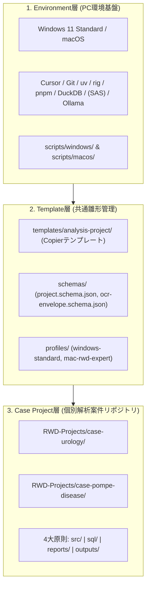
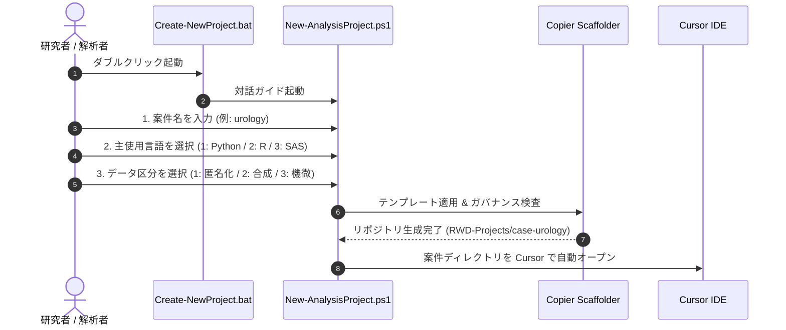

# 阪大・統計専門家向け RWD 解析・AI Agent 開発環境基盤

[](openspec/)
[](https://www.python.org/)
[](https://www.r-project.org/)
[-green.svg)](https://www.sas.com/)
[](LICENSE)

既存のSAS資産（CP932）やOffice報告業務を維持しつつ、Python、R、Git、AI Agent（Cursor / ローカルLLM）を活用したモダンで再現性の高いReal World Data（RWD）解析基盤です。

> 💡 **SASをお持ちでない方へ**: 本基盤は **SASが未導入のPCでも、Python 3.12.14 / R 4.6.1 / DuckDB / Quarto による最新の解析環境を100%利用可能** です。

> 🧭 **GitHubアカウントをお持ちでない方へ**: 初期セットアップとローカルのCase Project作成には、GitHubアカウントは必要ありません。まずは配布されたZIPを展開し、PC内で解析を始められます。GitHubは、共同作業やバックアップが必要になった段階で追加すれば十分です。

---

## 🏛️ 3層アーキテクチャ



---

## 🧭 利用フェーズ別ナビゲーション

### ① 【初めて使う方】Windows 11 初期環境セットアップ
クリーンな Windows 11 PC に解析ツール群（Git, uv, Python 3.12.14, R 4.6.1, Quarto, DuckDB, Node.js, Cursor設定）を一括自動導入します：

- **ワンクリック実行（推奨）**: 本リポジトリを展開し、ルートの **`Setup-Windows.bat`** を右クリック → **「管理者として実行」**
- **PowerShell から実行**:
  ```powershell
  Set-ExecutionPolicy -Scope Process -ExecutionPolicy Bypass
  .\scripts\windows\Setup-WindowsEnvironment.ps1
  ```

#### セットアップの再実行

`Setup-Windows.bat` は、環境確認や修復のために繰り返し実行できます。既に利用可能なツール、R 4.6.1、グローバル開発ツール、Cursor拡張機能は検出してスキップし、不足しているものだけを導入します。最後の稼働検証（Step 05）は毎回実行されます。
- 📖 詳細は [クリーン Windows 11 初期セットアップ手順書](docs/windows-bootstrap-guide.md) をご覧ください。

---

### ② 【導入済みの方】新規解析テーマ（Case Project）の生成

解析案件（例: 泌尿器科解析 `case-urology`、ポンペ病研究 `case-pompe-disease` など）ごとに、ガバナンスとセキュリティルール（4大原則: `src/`, `sql/`, `reports/`, `outputs/`）が組み込まれた独立Gitリポジトリを生成します。



---

#### 🚀 【手順 1】 ダブルクリックによる対話型作成（標準・推奨）

1. 本リポジトリルートにある **`Create-NewProject.bat`** をダブルクリックして起動します。
2. 画面の案内に従って以下の3つの質問にキーボードで回答します。

##### 💻 画面表示イメージ（対話ウィザード）:
```text
========================================================
  新規 RWD 解析プロジェクト (Case Project) 作成ガイド
========================================================

【1】プロジェクト名を入力してください（小文字英数字・ハイフン）
     例: urology -> 自動的に 'case-urology' と命名されます
  プロジェクト名 [既定: urology]: urology
  -> 設定された名前: case-urology

【2】主に使用する解析言語を選択してください
  1) Python  (推奨・標準データ解析環境)
  2) R       (推奨・統計解析環境)
  3) SAS     (CP932文字コード・既存SAS資産併用)
  選択 [1-3] (既定: 1): 1
  -> 解析言語: python

【3】扱うデータのセキュリティ区分を選択してください
  1) deidentified (匿名化データ・標準)
  2) synthetic    (テスト用合成データ)
  3) sensitive    (高セキュリティ機微データ)
  選択 [1-3] (既定: 1): 1
  -> データ区分: deidentified

[1/6] Generating project scaffold with Copier...
[2/6] Validating Project Schema & Directory Governance...
[3/6] Project Generated Successfully: C:\Users\YourName\Programing\RWD-Projects\case-urology
[4/6] Initializing local Git repository...
[5/6] Initial Git commit created.
[6/6] Launching Cursor IDE...
```

3. 完了すると生成された案件フォルダが **自動的に Cursor IDE で開かれます**。

---

#### 🛠️ 【手順 2】 コマンドライン／ターミナルからの作成（アドバンスド）

ターミナル（PowerShell / Bash）から引数を指定して一発で作成することも可能です。

##### 🔹 Windows (PowerShell) の場合
```powershell
# 1. 引数なしで実行（対話ウィザードが起動します）
.\scripts\project\New-AnalysisProject.ps1

# 2. 全パラメータを直接指定して非対話実行
.\scripts\project\New-AnalysisProject.ps1 -Name "case-urology" -PrimaryLanguage "python" -DataClassification "deidentified"
```

##### 🔹 macOS / Linux (Bash) の場合
```bash
# 1. 引数なしで実行（対話プロンプトが起動します）
./scripts/project/new-analysis-project.sh

# 2. 全パラメータを直接指定して実行
./scripts/project/new-analysis-project.sh case-pompe-disease mac-rwd-expert sensitive python
```

---

#### 📁 生成される Case Project の構造（4大原則）

作成されたプロジェクト（`RWD-Projects/case-<Name>`）内は、全案件共通で以下のフォルダ構成となっています：

| ディレクトリ | 用途・格納対象 | Git管理 |
| :--- | :--- | :--- |
| `src/` | Python / R / SAS スクリプト | ✅ Git管理 |
| `sql/` | SQL クエリ・ビュー定義 | ✅ Git管理 |
| `reports/` | Quarto 報告書（`.qmd`） / Slidev スライド | ✅ Git管理 |
| `outputs/private/` | 中間集計データ・作業中出力 | ❌ Git除外 |
| `outputs/release/` | 開示チェック済みの最終成果物 (`release-manifest.yml` 必須) | ✅ Git管理 |
| `data/` | 合成データ・公開サンプル | ⚠️ 実患者データは禁止 |

> 💡 **補足事項**:
> - **生成場所**: 既定では `%USERPROFILE%\Programing\RWD-Projects\<Name>` に自動作成されます。
> - **🎓 AI Agent スキルの全自動配備 (コピペ不要)**: マスター基盤（`.agents/skills/`）にある有用なスキル群が、作成される各プロジェクトの `.agents/skills/` へ**自動的にまるごとコピー配備**されます。受講生が手動でスキルをコピペする必要はありません。
> - **自動名前補正**: `urology` や `case_urology` と入力しても、全自動でハイフン区切りの `case-urology` に標準化されます。
> - **Git 初期コミット**: `git config --global user.name` および `user.email` が事前に設定されている場合、生成直後に「Initial Git commit」が自動作成されます（未設定時はスキップされます）。手順は [Git身元設定FAQ](docs/windows-bootstrap-guide.md#q6-case-project-はできたがinitial-git-commitがスキップされる) を参照してください。

---

### ③ 【日常の解析を行う方】解析実行・報告書作成・運用
- 📖 [初心者向けチートシート](docs/beginner-cheatsheet.md): 4大ディレクトリ配置と解析実行コマンド
- 🛠️ [日常運用マニュアル](docs/daily-operations.md): Python/R標準フロー、SASログ確認、成果物承認公開
- 🌱 [Git基本ワークフロー](docs/git-basic-workflow.md): GitHubなしのローカル運用から、将来のpush・pullまで
- 🤖 [Cursor AIプロンプトレシピ集](docs/ai-prompt-recipes.md): 統計・RWD初心者向けの安全なコピペ用依頼文

---

### ④ 【Mac 専門家向け】MySQL読取専用 ＆ ローカルOCR
```bash
# 1. 環境診断
./scripts/macos/diagnose.sh

# 2. macOS Keychain へのMySQLパスワード登録 (平文保存禁止)
python3 ./scripts/macos/configure-keychain.py set --username rwd_readonly_user

# 3. 読み取り専用MySQL 8.0接続・品質テスト (標準直接接続)
python3 ./scripts/macos/mysql-readonly-test.py --host 192.168.0.50

# 4. (任意) Excel/Office向け ODBC/DSN設定の検査
python3 ./scripts/macos/test-odbc.py --dsn rwd_research_db

# 5. 非匿名化データ処理前のオフライン事前検査
./scripts/macos/offline-check.sh
```

---

## 🧩 Agent Skills の配備

リポジトリで管理するSkillsの正本は **`.agents/skills/`** です。Case Project生成時に、このディレクトリの内容が生成先の `.agents/skills/` へコピーされます。Cursor固有のプロジェクトルールは引き続き `.cursor/rules/` で管理します。

## 📚 ドキュメント一覧

- 🚀 [クリーン Windows 11 初期セットアップ手順書](docs/windows-bootstrap-guide.md)
- 🧰 [Windows 初回セットアップ Troubleshoot](docs/windows-troubleshooting.md)
- 📖 [初心者向けチートシート](docs/beginner-cheatsheet.md)
- 🛠️ [日常運用マニュアル](docs/daily-operations.md)
- 🌱 [Git基本ワークフロー](docs/git-basic-workflow.md)
- 🤖 [Cursor AIプロンプトレシピ集](docs/ai-prompt-recipes.md)
- 📝 [AI Agent 開発知見・アーキテクチャメモ](docs/ai-memo.md)
- 📋 [ソフトウェア構成表（Software Bill of Materials）](docs/software-matrix.md)
- 🔤 [SAS CP932 文字コード管理マニュアル](docs/sas-cp932.md)
- 🔒 [MySQL 8.0 読取専用・ODBC接続基準](docs/mysql-readonly.md)
- 🛡️ [AI データ境界マトリクス](docs/ai-data-boundary.md)
- 🚨 [インシデント対応手順書](docs/incident-response.md)

### 開発者向け（macOS で Windows スクリプトを編集する場合）

Push 前に BOM 検査を実行してください（CI の Windows static gate でも同じ検査が走ります）:

```powershell
powershell -NoProfile -ExecutionPolicy Bypass -File .\scripts\windows\Assert-Utf8Bom.ps1
```

### GitHubを使い始めるタイミング

GitHubアカウントがない場合は、Case Project作成時に作られたローカルGitリポジトリで、変更履歴の保存と復元ができます。次のような状況になったら、GitHubなどの共有先を追加してください。

- 共同研究者と同じコードを共有したい
- PC故障に備えてリモートにバックアップしたい
- Pull Requestでレビューを受けたい

GitHubを使わない期間は、`commit`までで作業を完結できます。GitHubを使う場合の`push`・`pull`の順序は、[Git基本ワークフロー](docs/git-basic-workflow.md)を参照してください。

---

## ⚖️ セキュリティ・ガバナンス方針

1. **実RWDの物理隔離**: 実データおよび個人情報はGit管理対象外の保護領域（`C:\RWD_DATA\` 等）に配置します。
2. **`outputs/` の分離**: 中間データは `outputs/private/`（Git除外）、公開成果物は人手レビュー（`release-manifest.yml`）を経て `outputs/release/` に配置します。
3. **文字コード厳守**: SASプログラム（`src/sas-cp932/`）はCP932、Case Project 内の Python / R / TypeScript / Markdown は UTF-8（BOMなし）で分離します。例外として、プラットフォームの `scripts/windows/*.ps1`・`scripts/project/*.ps1`・`Setup-Windows.bat` は Windows PowerShell 5.1 互換のため **UTF-8（BOMあり）** 必須です（詳細は [AGENTS.md](AGENTS.md)）。
