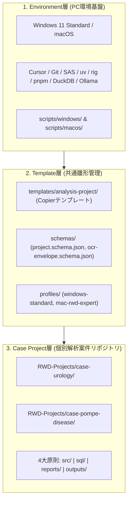

# 阪大・統計専門家向け RWD 解析・AI Agent 開発環境基盤

[](openspec/)
[](https://www.python.org/)
[](https://www.sas.com/)
[](https://www.r-project.org/)
[](LICENSE)

既存のSAS資産（CP932）やOffice報告業務を維持しつつ、Python、R、Git、AI Agent（Cursor / ローカルLLM）を活用したモダンで再現性の高いReal World Data（RWD）解析基盤です。

---

## 🏛️ 3層アーキテクチャ



---

## 🚀 クイックスタート

### #1 クリーンな Windows 11 の初期セットアップ（ゼロから一括導入）

SASとOfficeしか入っていないクリーンな Windows 11 PC では、**以下のいずれか1つ**を実行するだけで、全ツール群（Git, uv, Python 3.12, Copier, rig, R 4.4, Quarto, DuckDB, Node.js, pnpm, Cursor設定, CP932マッピング）が完全自動でセットアップされます：

#### 【方法 A】 ワンクリック実行（最も推奨）
本リポジトリを展開し、ルートにある **`Setup-Windows.bat`** を右クリックして **「管理者として実行」** を選択します。

#### 【方法 B】 PowerShell から 1 コマンド実行
```powershell
Set-ExecutionPolicy -Scope Process -ExecutionPolicy Bypass
.\scripts\windows\Setup-WindowsEnvironment.ps1
```

> 📖 詳しい画面付き手順は [クリーンな Windows 11 向け初期セットアップ手順書](docs/windows-bootstrap-guide.md) をご覧ください。

---

### #2 新規解析テーマ（Case Project）の生成

環境構築後、新しい解析案件（例: 泌尿器科、ポンペ病など）を始める際は、以下のコマンド1発で標準化された独立Gitリポジトリを生成します：

```powershell
# Windows 11 の場合
.\scripts\project\New-AnalysisProject.ps1 `
  -Name "case-urology" `
  -Profile "windows-standard" `
  -DataClassification "deidentified"
```

```bash
# macOS の場合
./scripts/project/new-analysis-project.sh \
  case-pompe-disease \
  mac-rwd-expert \
  sensitive
```

---

### #3 Mac 専門家向け（MySQL読取専用 ＆ ローカルOCR）

```bash
# 1. 環境診断
./scripts/macos/diagnose.sh

# 2. macOS Keychain へのMySQLパスワード登録 (平文保存禁止)
python3 ./scripts/macos/configure-keychain.py set --username rwd_readonly_user

# 3. 読み取り専用MySQL 8.0接続・品質テスト (標準直接接続)
python3 ./scripts/macos/mysql-readonly-test.py --host 192.168.0.50

# 4. (任意) Excel/Office向け ODBC/DSN設定の検査
python3 ./scripts/macos/test-odbc.py --dsn rwd_research_db

# 5. 非匿名化データ処理前のオフライン事前検査
./scripts/macos/offline-check.sh
```

---

## 📚 ドキュメント一覧

- 🚀 [クリーン Windows 11 初期セットアップ手順書](docs/windows-bootstrap-guide.md)
- 📖 [初心者向けチートシート](docs/beginner-cheatsheet.md)
- 🛠️ [日常運用マニュアル](docs/daily-operations.md)
- 📋 [ソフトウェア構成表（BOM）](docs/software-matrix.md)
- 🔤 [SAS CP932 文字コード管理マニュアル](docs/sas-cp932.md)
- 🔒 [MySQL 8.0 読取専用・ODBC接続基準](docs/mysql-readonly.md)
- 🛡️ [AI データ境界マトリクス](docs/ai-data-boundary.md)
- 🚨 [インシデント対応手順書](docs/incident-response.md)

---

## ⚖️ セキュリティ・ガバナンス方針

1. **実RWDの物理隔離**: 実データおよび個人情報はGit管理対象外の保護領域（`C:\RWD_DATA\` 等）に配置します。
2. **`outputs/` の分離**: 中間データは `outputs/private/`（Git除外）、公開成果物は人手レビュー（`release-manifest.yml`）を経て `outputs/release/` に配置します。
3. **文字コード厳守**: SASプログラム（`src/sas-cp932/`）はCP932、その他はUTF-8で完全分離します。
