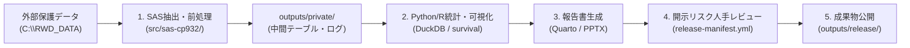

# 日常運用マニュアル（Daily Operations Manual）

本マニュアルは、Case Projectにおける日々の解析ワークフロー、SASログ確認、データ連携、成果物の承認公開、およびテンプレート更新の手順を解説します。

---

## 1. 標準的な解析フロー



---

## 2. SAS実行とログ確認（`invoke-sas.ps1`）

1. **プログラムの実行**:
   - Cursorで対象の `.sas` を開き、`Ctrl + Shift + B` を実行します。
2. **実行結果の確認**:
   - 実行ログと出力ファイルは `.run/sas/<program>/<timestamp>/` に分離生成されます。
   - ログ内に `ERROR:` が存在する場合、コンソールに赤字でエラー内容がハイライトされます。
3. **文字コードの維持**:
   - SASソースはCP932で保存されます。日本語ラベルやコメントの文字化けが発生しないことを確認してください。

---

## 3. Python / R でのSASデータ受け渡し

SASで出力した中間データセット（`.sas7bdat` 等）をPythonやRで読み込む場合、文字コードを明示的に指定します。

### Python (`pyreadstat`) での読み込み例:
```python
import pyreadstat

# 外部データ領域からCP932エンコーディングで読込
df, meta = pyreadstat.read_sas7bdat(
    "C:/RWD_DATA/case-urology/cohort.sas7bdat",
    encoding="cp932"
)
```

### R (`haven`) での読み込み例:
```r
library(haven)
cohort <- read_sas("C:/RWD_DATA/case-urology/cohort.sas7bdat", encoding = "cp932")
```

---

## 4. 成果物の承認と公開手順 (`outputs/release/`)

集約表、グラフ、PowerPointスライドを外部報告に用いる際は、必ず以下の手順を踏みます：

1. 成果物（例: `summary_table.xlsx`, `report.pptx`）を `outputs/release/` にコピーします。
2. `outputs/release/release-manifest.yml` を開き、以下のチェック項目を確認して `true` に更新します：
   ```yaml
   release:
     project_id: "case-urology"
     reviewed_at: "2026-08-23"
     reviewed_by: "山口 (研究責任者)"
     data_classification: "deidentified"
     approved_files:
       - "summary_table.xlsx"
       - "report.pptx"
     checks:
       direct_identifiers_removed: true
       small_cells_reviewed: true
       free_text_reviewed: true
       disclosure_risk_reviewed: true
     disclosure_control:
       rule_reference: "Osaka Univ Biostat Guidelines"
       small_cell_threshold: 5
       notes: "5例未満のセルはハイフン(-)にマスキング済み"
   ```
3. プロジェクト整合性検査を実行して合格を確認します：
   ```powershell
   uv run python scripts/validate-project.py --project-dir .
   ```
4. Gitコミットを行います。

---

## 5. テンプレート更新の検知と適用

共通基盤テンプレート（`templates/analysis-project`）に新機能や設定更新があった場合：

1. **作業ツリーの確認**:
   - `git status` で未コミットの変更がないことを確認します。
2. **更新チェック**:
   ```bash
   copier update --check-only
   ```
3. **更新の適用とレビュー**:
   ```bash
   copier update
   ```
   - 競合（Conflict）が発生した場合は自動解決せず、差分を確認して手動でマージしてください。
