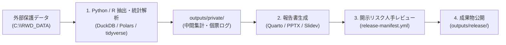
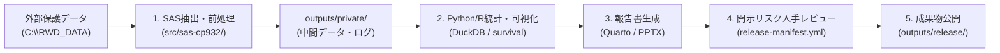

# 日常運用マニュアル（Daily Operations Manual）

本マニュアルは、Case Projectにおける日々の解析ワークフロー、Python/Rによる標準解析、SASログ確認、成果物の承認公開、およびテンプレート更新の手順を解説します。

GitHubをまだ利用していない場合でも、解析はローカルGitリポジトリだけで継続できます。日々の変更履歴は`commit`で保存し、共同研究やバックアップが必要になった段階で[Git基本ワークフロー](git-basic-workflow.md)に従ってGitHub連携を追加します。Cursorへの依頼文は[Cursor AIプロンプトレシピ集](ai-prompt-recipes.md)を利用してください。

---

## 1. 標準的な解析フロー（2つのパターン）

### パターン A: Python / R 中心解析（SAS不要・推奨標準フロー）
SASライセンスを持たない環境、またはモダンな言語スタック単体で解析を行う場合の標準フローです。



### パターン B: 既存SAS資産併用フロー（SAS保有時のみ）
既存のSASマクロやレガシー前処理コードを活用する場合のフローです。



---

## 2. Python / R による日々の解析実行

### Python 解析（`uv` 環境）
```powershell
# 依存パッケージを同期して実行
uv run python src/python/sample_rwd_pipeline.py
```

### R 統計解析
```powershell
# R スクリプトの実行
Rscript src/r/sample_survival_analysis.R
```

### Quarto 報告書 ＆ プレゼン生成
```powershell
# 1. 静的 Quarto レポートの生成 (HTML / PDF / DOCX)
quarto render reports/quarto/summary.qmd

# 2. 完全オフライン対応・インタラクティブ HTML レポートの生成 (outputs/private/ に出力)
pnpm report:interactive

# 3. インタラクティブレポートのローカル安全プレビュー (127.0.0.1)
pnpm report:preview

# 4. PowerPoint スライド生成
pnpm report:pptx
```

#### 🌐 共同研究者・臨床医へのインタラクティブ報告書配布手順
1. **事前集約データの生成**: `uv run python src/python/sample_rwd_pipeline.py` を実行し、5例未満の全集計値抑制が適用された `outputs/private/interactive_cohort_summary.json` が生成されたことを確認します。
2. **HTMLのレンダリング**: `pnpm run report:interactive` を実行し、完全自己完結型HTML（`outputs/private/interactive_summary.html`）を出力します。
3. **安全検査**: `uv run python scripts/validate-project.py --project-dir .` を実行し、外部URL依存や個人情報混入がないことを確認します。
4. **開示統制承認**: HTMLを `outputs/release/` にコピーし、`release-manifest.yml` を記入・コミットします。
5. **配布と閲覧**: 共同研究者へHTMLファイルを渡します。共同研究者は **ファイルをダブルクリック（`file://`）するだけで、Edge / Chrome 上で動的フィルタやグラフ操作が可能** です（PythonやRの導入は一切不要です）。

---

## 3. SAS 実行とログ確認（`invoke-sas.ps1` - 任意機能）

> ℹ️ **本セクションは SAS 9.4 がインストールされている環境でのみ利用します。**

1. **プログラムの実行**:
   - Cursorで対象の `.sas` を開き、`Ctrl + Shift + B` を実行します。
2. **実行結果の確認**:
   - 実行ログと出力ファイルは `.run/sas/<program>/<timestamp>/` に分離生成されます。
   - ログ内に `ERROR:` が存在する場合、コンソールに赤字でエラー内容がハイライトされます。
3. **文字コードの維持**:
   - SASソースはCP932で保存されます。日本語ラベルやコメントの文字化けが発生しないことを確認してください。

---

## 4. Python / R でのSASデータ受け渡し（任意・SAS併用時）

SASで前処理・出力した中間データセット（`.sas7bdat` 等）をPythonやRで読み込む場合、CP932文字コードを明示的に指定します。

### Python (`pyreadstat`) での読み込み例:
```python
import pyreadstat

# 外部データ領域からCP932エンコーディングで読込
df, meta = pyreadstat.read_sas7bdat(
    "C:/RWD_DATA/case-urology/cohort.sas7bdat",
    encoding="cp932"
)
```

### R (`haven`) での読み込み例:
```r
library(haven)
cohort <- read_sas("C:/RWD_DATA/case-urology/cohort.sas7bdat", encoding = "cp932")
```

---

## 5. インタラクティブHTML報告書の生成と配布手順

完全自己完結（Pure Local / 外部通信ゼロ）のインタラクティブHTML報告書（`outputs/private/interactive_summary.html`）を生成・配布する場合の手順です：

### 1. 事前集約データの生成と小セル抑制
個票生データをブラウザに渡さないため、必ずパイプラインを実行して5例未満の全集計値を抑制した集約JSONを生成します：
```powershell
uv run python src/python/sample_rwd_pipeline.py
```
- 出力先: `outputs/private/interactive_cohort_summary.json` （Git除外）

### 2. インタラクティブ報告書のレンダリング
```powershell
pnpm run report:interactive
```
- 出力先: `outputs/private/interactive_summary.html`

### 3. ローカルでの動作確認
- **ダブルクリック（`file://`）起動**: エクスプローラーから `outputs/private/interactive_summary.html` を Microsoft Edge または Google Chrome でダブルクリックして開き、群・性別の動的フィルタリングおよびSVGチャートの再描画が即座に動作することを確認します。
- **ローカルHTTPプレビュー（任意）**:
  ```powershell
  pnpm run report:preview
  ```
  ブラウザで `http://127.0.0.1:8000/interactive_summary.html` を開きます。

### 4. 共同研究者への配布（`outputs/release/`）
1. 承認用として `outputs/private/interactive_summary.html` を `outputs/release/` にコピーします。
2. `outputs/release/release-manifest.yml` の `approved_files` に `interactive_summary.html` を追記し、開示統制チェック（小セル全集計値抑制、識別子除去）を確認して `true` に更新・署名します。
3. プロジェクト整合性検査を実行して外部通信依存や識別子混入がないことを機械検証します：
   ```powershell
   uv run python scripts/validate-project.py --project-dir .
   ```

---

## 6. 成果物の承認と公開手順 (`outputs/release/`)

集約表、グラフ、PowerPointスライドを外部報告に用いる際は、必ず以下の手順を踏みます：

1. 成果物（例: `summary_table.xlsx`, `report.pptx`）を `outputs/release/` にコピーします。
2. `outputs/release/release-manifest.yml` を開き、以下のチェック項目を確認して `true` に更新します：
   ```yaml
   release:
     project_id: "case-urology"
     reviewed_at: "2026-08-23"
     reviewed_by: "山口 (研究責任者)"
     data_classification: "deidentified"
     approved_files:
       - "summary_table.xlsx"
       - "report.pptx"
     checks:
       direct_identifiers_removed: true
       small_cells_reviewed: true
       free_text_reviewed: true
       disclosure_risk_reviewed: true
     disclosure_control:
       rule_reference: "Osaka Univ Biostat Guidelines"
       small_cell_threshold: 5
       notes: "5例未満のセルはハイフン(-)にマスキング済み"
   ```
3. プロジェクト整合性検査を実行して合格を確認します：
   ```powershell
   uv run python scripts/validate-project.py --project-dir .
   ```
4. Gitコミットを行います。

---

## 7. テンプレート更新の検知と適用

共通基盤テンプレート（`templates/analysis-project`）に新機能や設定更新があった場合：

1. **作業ツリーの確認**:
   - `git status` で未コミットの変更がないことを確認します。
2. **更新チェック**:
   ```bash
   copier update --check-only
   ```
3. **更新の適用とレビュー**:
   ```bash
   copier update
   ```
   - 競合（Conflict）が発生した場合は自動解決せず、差分を確認して手動でマージしてください。
