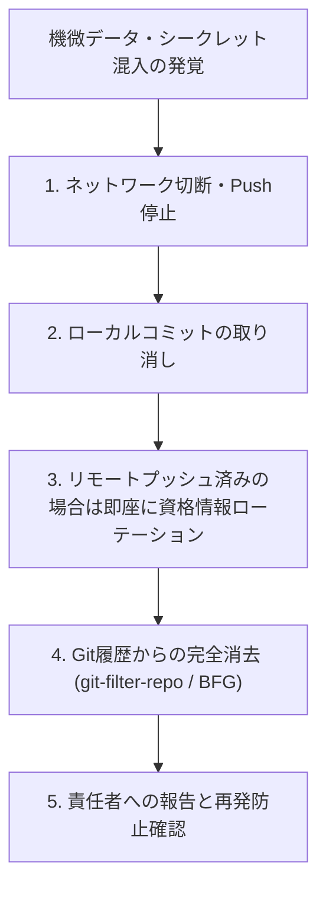

# インシデント対応手順書（Incident Response Plan）

万が一、機微データやパスワードを誤ってコミットまたはGitにプッシュしてしまった場合の緊急対応手順です。

---

## 🚨 緊急初動フロー



---

## 🛠️ 具体的な対処手順

### 1. ローカルコミット済み・Push前の場合（最軽微）
コミットを取り消し、機微ファイルを外部領域へ移動します：
```bash
# 直前のコミットを取り消し（変更は作業ツリーに残す）
git reset --soft HEAD~1

# 機微ファイルをGit管理外へ移動後、安全なファイルのみ再コミット
git reset HEAD path/to/sensitive_file.csv
```

### 2. リモート（GitHub Private）にPushしてしまった場合
1. **即座にパスワード変更（資格情報のローテーション）**:
   - 漏洩したMySQLユーザーのパスワードを即座に変更・再設定します。
2. **Git履歴からの完全消去**:
   - 単に `git rm` してコミットするだけでは過去履歴に残ります。
   - `git-filter-repo` を用いて、履歴全体から該当ファイルを完全に抹消します：
     ```bash
     git filter-repo --path path/to/sensitive_file.csv --invert-paths
     git push origin --force --all
     ```
3. **報告**:
   - 研究責任者（山口）および情報セキュリティ担当者に速やかに報告し、アクセスログを点検します。
