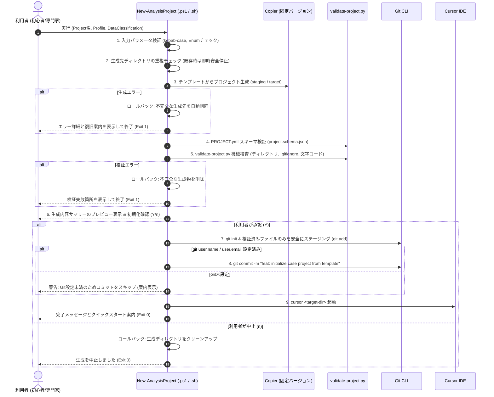

## Context

阪大の統計専門家および研究チームにおけるRWD解析環境として、既存のSAS資産（CP932）やOffice報告業務を維持しつつ、Python/R/Git/Cursorを活用する共通基盤を構築する。

本設計では、「Environment層（PC環境基盤）」「Template層（共通雛形管理）」「Case Project層（個別解析案件リポジトリ）」の3層アーキテクチャを採用し、共通基盤リポジトリと個別のCase Projectを独立したGitリポジトリとして分離運用する。

## Goals / Non-Goals

**Goals:**
- **リポジトリ分離とCopier自動生成**: 共通基盤リポジトリ（`scripts/`, `templates/`, `schemas/`, `profiles/`）から、テーマごとの独立したCase Projectリポジトリを1コマンドで安全に生成する。
- **厳格なセキュリティ境界と開示統制**: 実データおよび認証情報はProject外に物理隔離し、`outputs/private/` のGit除外、`outputs/release/` の `release-manifest.yml` による人手承認を徹底する。
- **文字コードとタスクの完全分離**: SAS CP932コードとPython/R/TS UTF-8コードをディレクトリ単位で分離し、Cursorタスク（`invoke-sas.ps1`）でバッチ実行とログ解析を自動化する。
- **教室内MySQL接続の責務分離**:
  - **標準経路（推奨）**: Python（`PyMySQL`）および R（`RMariaDB`）による自己完結型の直接接続。
  - **任意経路（Office用）**: `MySQL Connector/ODBC` + `iODBC` / DSN による追加プロファイル（DSNパスワード非保持、ARM64/x86_64適合性検査、メタデータ限定の疎通確認）。
- **クロスプラットフォーム共通契約**: Windows 11とmacOSで共通の終了コード、JSON診断フォーマット、ログ配置、ドライラン機能、バージョン固定マニフェストを規定する。
- **決定論的検査と自動テスト証跡**: `tests/test_all_scenarios.py` による全シナリオの網羅的自動テスト。

**Non-Goals:**
- 疾患固有（泌尿器科、ポンペ病等）の変数定義や医学的判断を共通テンプレートにハードコードすること（Case Project側に委ねる）。
- 認証情報や実RWD、非匿名化PDFのGitリポジトリ内への保存（DSNや `.env` 含む）。
- ODBCをPython/Rの標準・必須接続方式として強制すること。
- 手動レビューや開示リスク判断を伴わない、`outputs/release/` やGitHub Pushの無条件な自動実行。

## Decisions

### 1. リポジトリ構成と3層アーキテクチャ

```text
【共通基盤リポジトリ】 (本リポジトリ)
├─ README.md
├─ AGENTS.md
├─ scripts/
│  ├─ windows/        # 00-diagnose 〜 05-verify, invoke-sas.ps1
│  ├─ macos/          # diagnose.sh, keychain, mysql-ro, test-odbc.py, ocr/, offline-check.sh
│  └─ project/        # New-AnalysisProject.ps1, new-analysis-project.sh, validate-project.py
├─ profiles/
│  ├─ windows-standard/ # Windows用ツール定義・バージョンマニフェスト
│  └─ mac-rwd-expert/   # Mac用ツール・Ollamaモデル・ODBC任意定義
├─ templates/
│  └─ analysis-project/ # Copierテンプレート (copier.yml, Jinja雛形)
├─ schemas/
│  ├─ project.schema.json      # PROJECT.yml検証スキーマ
│  └─ ocr-envelope.schema.json  # 疾患非依存のOCR監査スキーマ
├─ docs/              # ソフトウェア構成表, チートシート, 運用手順書, MySQL/ODBCガイド
├─ synthetic-data/    # 合成ダミー医療データ
└─ tests/             # 全シナリオ自動検証テストスイート
```

### 2. 教室内MySQL 8.0 接続アーキテクチャ（標準直接接続 vs 任意ODBCプロファイル）

```mermaid
graph TD
    subgraph Client["MacBook Pro (128GB RAM)"]
        subgraph StandardPath["【標準経路 (推奨)】"]
            PyDirect["Python (PyMySQL / mysql-connector-python)"]
            RDirect["R (RMariaDB / DBI)"]
        end
        subgraph OptionalPath["【任意経路 (Office/Excel用)】"]
            OfficeApp["Excel / FileMaker / Office"]
            ODBC["MySQL Connector/ODBC (iODBC)"]
            DSN["~/Library/ODBC/odbc.ini (DSN: rwd_research_db)"]
        end
        Keychain["macOS Keychain (Service: rwd_mysql_readonly)"]
    end

    subgraph Server["教室内LAN (192.168.0.50:3306)"]
        MySQL["MySQL 8.0 Server (Read-Only User)"]
    end

    Keychain -.->|メモリ上読込| PyDirect
    Keychain -.->|メモリ上読込| RDirect
    Keychain -.->|対話入力/Keychain連携 (DSN平文保存禁止)| ODBC

    PyDirect -->|直接TCP (3306)| MySQL
    RDirect -->|直接TCP (3306)| MySQL
    OfficeApp --> ODBC
    ODBC --> DSN
    DSN -->|ODBC TCP (3306)| MySQL
```

1. **標準直接接続の独立性**:
   - Python・Rは外部ODBCドライバやDSN設定に依存せず、自己完結型の純粋ドライバで直接TCP接続する。ODBCドライバの有無や不整合によってPython/Rの動作が妨げられることはない。
2. **ODBC/DSNプロファイルの規約**:
   - **ドライバアーキテクチャ適合**: Apple Silicon（ARM64）環境では `libmyodbc8w.so` (ARM64版) を使用し、Intel版との混在不一致を検査する。
   - **DSNセキュリティ**: `odbc.ini` に `PWD`（パスワード）を絶対に記述しない。接続時にKeychainから取得するか、対話プロンプトで入力する。
   - **疎通確認の限定**: 接続テストは `SELECT VERSION()`, `SELECT CURRENT_USER()` 等のメタデータ確認のみに限定し、個票データを一切取得しない。

### 3. Case Project生成フローと失敗時ロールバック



### 4. セキュリティ境界と機微データ管理

| 区分 | 保存場所 | Git追跡 | AI利用方針 (Cursor / ローカルLLM) |
| :--- | :--- | :--- | :--- |
| **実RWD / 生データ** | Project外部保護領域 (`C:\RWD_SECURE\...` 等) | **完全不可** (物理的分離) | クラウドAI入力**禁止** (ローカルLLM/オフラインのみ) |
| **機微中間集計 / ログ** | `outputs/private/` | **完全不可** (`.gitignore`) | クラウドAI入力**禁止** |
| **公開・報告用成果物** | `outputs/release/` | **条件付き許可** (`release-manifest.yml` 必須) | 集約・非識別化済み要約のみ利用可 |
| **合成データ** | `data/synthetic/` | **許可** | CursorクラウドAI利用**可** (テスト・コード生成) |
| **DBパスワード** | macOS Keychain (`keyring`) / CLI対話入力 | **完全不可** (DSN/ファイル保存禁止) | AIチャットプロンプトへの入力**禁止** |
| **非機微接続設定** | `config/local.paths.yml` | **完全不可** (`.gitignore`) | 利用可 |

### 5. Windows/Mac クロスプラットフォーム共通契約

- **終了コード体系**:
  - `0`: 正常終了 (Success)
  - `1`: 一般エラー / 検証失敗 (Verification Failed / Validation Error)
  - `2`: 前提ツール・権限不足 (Prerequisite / Environment Mismatch)
  - `3`: セキュリティ・権限違反 (Security / Access Violation)
- **統一された実行・ログディレクトリ体系 (`.run/` - Git完全除外)**:
  - `.run/logs/`: 一般スクリプト・ツール実行ログ
  - `.run/reports/`: 構造化診断・検査レポート（`diagnose-report.json`, `diagnose-mac-report.json`）
  - `.run/sas/<program>/<timestamp>/`: SASバッチ実行専用のログ（`program.log`）、出力（`program.lst`）、実行メタデータ（`run-metadata.json`）
- **非侵入型検査**: `validate-project.py` は作業ツリーに一時ファイルを作成せず `git check-ignore --stdin` を使用する。

## Risks / Trade-offs

- **[Risk] ODBCドライバのARM64/x86_64アーキテクチャ不一致によるクラッシュ**  
  → *Mitigation*: `scripts/macos/test-odbc.py` および診断にて、システムのCPUアーキテクチャとドライババイナリの一致を事前に検証。
- **[Risk] DSN設定ファイル（`odbc.ini`）へのパスワード誤記録**  
  → *Mitigation*: ドキュメントおよび検査スクリプトでDSNへのパスワード記載を禁止し、Keychainまたは都度入力を強制。
- **[Risk] SAS CP932コードがCursorやGitで意図せずUTF-8変換される**  
  → *Mitigation*: `src/sas-cp932/` ディレクトリで物理分離し、`.vscode/settings.json` の `files.associations` / `files.encoding` でCP932を強制。`validate-project.py` で再帰的エンコーディング検査。
- **[Risk] 初心者による実データ（.sas7bdat / CSV）の誤コミット**  
  → *Mitigation*: 厳格な `.gitignore`、Gitleaksスキャン、pre-commitフック、および `validate-project.py` による二重三重の自動検出。
